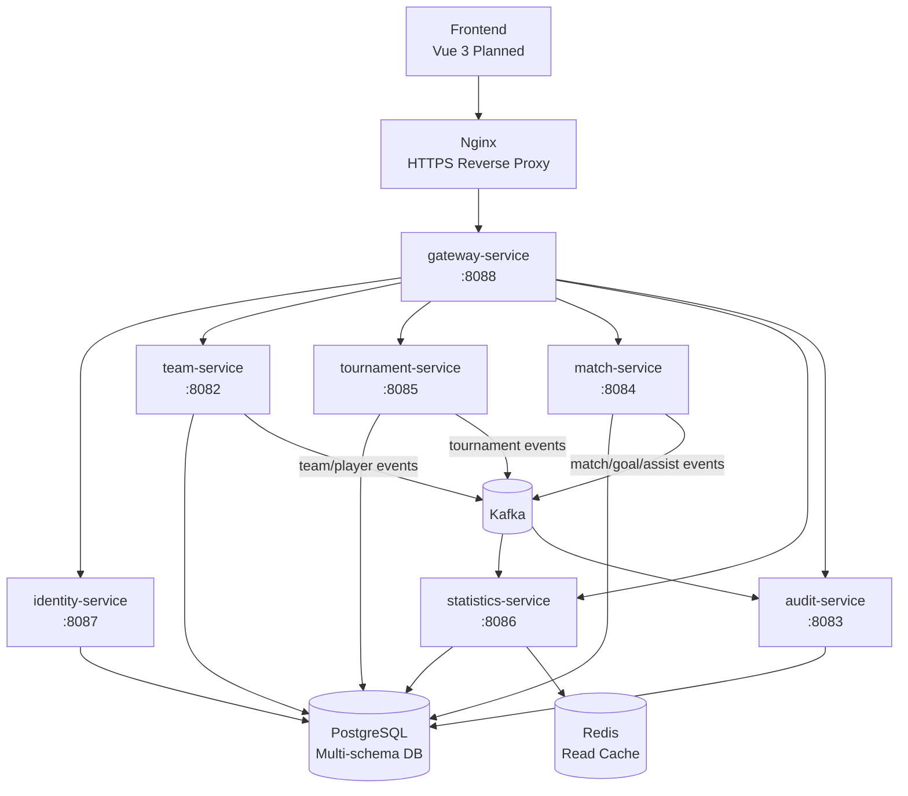

# Team Management System

> Football Team Management Platform Based on Spring Boot Microservices

A production-oriented football team management backend built with Spring Boot microservices. The system manages teams, players, tournaments, matches, goals, assists, statistics projections, audit logs, authentication, and role-based authorization through a gateway-first architecture.

This repository is designed to be readable as a Java backend portfolio project and practical as a deployment-ready microservice backend.

## 📌 Table of Contents

- [Overview](#-overview)
- [Technology Stack](#-technology-stack)
- [System Architecture](#-system-architecture)
- [Microservices](#-microservices)
- [Database Architecture](#-database-architecture)
- [Kafka Event Architecture](#-kafka-event-architecture)
- [Reliability Patterns](#-reliability-patterns)
- [Security Architecture](#-security-architecture)
- [RBAC Matrix](#-rbac-matrix)
- [OpenAPI](#-openapi)
- [Quick Start](#-quick-start)
- [Docker Deployment](#-docker-deployment)
- [Production Deployment](#-production-deployment)
- [Current Status](#-current-status)
- [Roadmap](#-roadmap)
- [License](#-license)

## 🧭 Overview

Team Management System is a backend platform for managing a football club or football team operation.

Core capabilities:

- Team Management
- Player Management
- Tournament Management
- Match Management
- Goal & Assist Tracking
- Statistics Dashboard
- Audit Logging
- Authentication & Authorization

The project uses synchronous REST APIs for user-facing operations and asynchronous Kafka events for cross-service synchronization, statistics projections, and audit logging.

## 🧰 Technology Stack

### Backend

- Java 17
- Spring Boot
- Spring Cloud Gateway
- Spring Security
- Spring Data JPA
- PostgreSQL
- Kafka
- Redis
- SpringDoc OpenAPI

### Infrastructure

- Docker
- Docker Compose
- Nginx
- Let's Encrypt

### Frontend Planned

- Vue 3
- TypeScript
- Vite
- Pinia
- Element Plus

## 🏗️ System Architecture



## 🧩 Microservices

| Service | Port | Responsibility | Main APIs |
| --- | ---: | --- | --- |
| `gateway-service` | `8088` | API gateway, route forwarding, JWT validation, gateway-level RBAC, Swagger aggregation | `/api/**`, `/openapi/**`, `/swagger-ui.html`, `/actuator/health` |
| `identity-service` | `8087` | Authentication, refresh tokens, current user, user management, role management | `/api/auth/login`, `/api/auth/refresh`, `/api/auth/logout`, `/api/auth/change-password`, `/api/auth/me`, `/api/users/**`, `/api/roles/**` |
| `team-service` | `8082` | Team management, player management, player status history, internal team/player validation | `/api/teams`, `/api/teams/our`, `/api/teams/{id}`, `/api/players`, `/api/players/{id}`, `/api/players/{id}/status`, `/api/teams/{teamId}/players` |
| `tournament-service` | `8085` | Tournament lifecycle management and tournament snapshots | `/api/tournaments`, `/api/tournaments/{id}`, `/api/tournaments/{id}/finish`, `/api/tournaments/{id}/cancel` |
| `match-service` | `8084` | Match scheduling, results, player appearances, goals, assists | `/api/v1/matches`, `/api/v1/matches/{id}`, `/api/v1/matches/{id}/result`, `/api/v1/matches/{id}/appearances`, `/api/v1/matches/{matchId}/goals`, `/api/v1/goals/{goalId}`, `/api/v1/goals/{goalId}/assist` |
| `statistics-service` | `8086` | Event-driven read models, match summaries, player statistics, team standings, leaderboards, dashboard cache | `/api/statistics/health`, `/api/statistics/matches`, `/api/statistics/players`, `/api/statistics/teams`, `/api/statistics/leaderboards`, `/api/statistics/dashboard` |
| `audit-service` | `8083` | Event-driven operation logs and audit queries | `/api/audit/logs`, `/api/audit/logs/{id}` |

All public application traffic should enter through `gateway-service`. Internal endpoints such as `/internal/**` are used for service-to-service validation and are not intended as public APIs.

## 🗄️ Database Architecture

The project uses PostgreSQL with a multi-schema architecture.

Schemas:

- `identity`
- `team`
- `tournament`
- `match`
- `statistics`
- `audit`

Design principles:

- Database per Service Boundary
- One PostgreSQL database with isolated service schemas for local and Docker simplicity
- No Cross-Service FK
- Event Driven Synchronization
- Service-owned tables and migrations
- Read models maintained by consumers instead of cross-service joins

## 📨 Kafka Event Architecture

Kafka is used for asynchronous domain event propagation.

### Producers

| Producer | Topic | Event Examples |
| --- | --- | --- |
| `team-service` | `team-service.team-events` | `team.created`, `team.updated`, `team.deleted`, `player.created`, `player.updated`, `player.deleted`, `player.status.changed` |
| `tournament-service` | `tournament-service.tournament-events` | `tournament.created`, `tournament.updated`, `tournament.finished`, `tournament.cancelled` |
| `match-service` | `match-service.match-events` | `match.created`, `match.result.updated`, `match.appearance.updated`, `match.goal.created`, `match.goal.updated`, `match.goal.deleted`, `match.assist.upserted`, `match.assist.deleted` |

### Consumers

| Consumer | Consumed Topics | Responsibility |
| --- | --- | --- |
| `statistics-service` | `match-service.match-events` | Builds match summaries, player statistics, team standings, leaderboards, and dashboard projections |
| `audit-service` | `team-service.team-events`, `match-service.match-events`, `tournament-service.tournament-events` | Stores operational audit logs for domain changes |

Supported statistics event aliases include `match.assist.created` and `match.assist.updated`, which are normalized to the assist upsert handling path.

## 🛡️ Reliability Patterns

### Outbox Pattern

Implemented in event-producing services:

- `team-service`
- `tournament-service`
- `match-service`

Domain operations persist business data and outbox records in the same database transaction. Background publishers send pending outbox events to Kafka and update publish status with retry handling.

### Idempotent Consumer

Implemented in event-consuming services:

- `statistics-service`
- `audit-service`

Consumers record processed event IDs and skip duplicate messages, which makes Kafka redelivery safe for projection and audit workloads.

## 🔐 Security Architecture

The system uses JWT-based authentication and gateway-level authorization.

Authorization header:

```http
Authorization: Bearer <token>
```

Gateway responsibilities:

- JWT Validation
- RBAC Enforcement
- Route Forwarding
- Swagger/OpenAPI access control
- Propagation of authenticated user context to downstream services

Roles:

- `ADMIN`
- `COACH`
- `PLAYER`

Public endpoints:

- `POST /api/auth/login`
- `POST /api/auth/refresh`
- `GET /actuator/health`
- Swagger/OpenAPI endpoints only when `gateway.swagger.public=true`

Self-service authenticated endpoints:

- `POST /api/auth/logout`
- `POST /api/auth/change-password`

## 🧾 RBAC Matrix

Gateway authorization is method-based with stricter rules for identity management APIs.

| Operation | ADMIN | COACH | PLAYER |
| --- | --- | --- | --- |
| `GET /api/**` | ✅ | ✅ | ✅ |
| `POST /api/**` | ✅ | ✅ | ❌ |
| `PUT /api/**` | ✅ | ✅ | ❌ |
| `PATCH /api/**` | ✅ | ✅ | ❌ |
| `DELETE /api/**` | ✅ | ✅ | ❌ |
| `POST /api/auth/logout` | ✅ | ✅ | ✅ |
| `POST /api/auth/change-password` | ✅ | ✅ | ✅ |
| `/api/users/**` | ✅ | ❌ | ❌ |
| `/api/roles/**` | ✅ | ❌ | ❌ |
| Swagger/OpenAPI in production | ✅ | ❌ | ❌ |

Notes:

- `POST /api/auth/login` and `POST /api/auth/refresh` are public.
- `GET /actuator/health` is public through the gateway.
- In production, `gateway.swagger.public=false` makes Swagger/OpenAPI ADMIN-only.

## 📚 OpenAPI

SpringDoc OpenAPI is implemented for all backend services and aggregated through the gateway Swagger UI.

Local Swagger UI:

```text
http://localhost:8088/swagger-ui.html
```

Aggregated OpenAPI routes through gateway:

```text
http://localhost:8088/openapi/identity/v3/api-docs
http://localhost:8088/openapi/team/v3/api-docs
http://localhost:8088/openapi/tournament/v3/api-docs
http://localhost:8088/openapi/match/v3/api-docs
http://localhost:8088/openapi/statistics/v3/api-docs
http://localhost:8088/openapi/audit/v3/api-docs
```

Generated OpenAPI JSON files are also available under `openapi/`.

Production behavior:

- `docker-compose.prod.yml` sets `GATEWAY_SWAGGER_PUBLIC=false` by default through `gateway.swagger.public`.
- When Swagger is not public, `/swagger-ui.html`, `/swagger-ui/**`, `/v3/api-docs/**`, `/openapi/**`, and `/webjars/**` require the `ADMIN` role.

## 🚀 Quick Start

### Prerequisites

- Docker
- Docker Compose

### Start All Services

```bash
docker compose up -d --build
```

This starts:

- PostgreSQL
- Kafka
- Redis
- Kafka UI
- Gateway Service
- Identity Service
- Team Service
- Tournament Service
- Match Service
- Statistics Service
- Audit Service

### Check Containers

```bash
docker compose ps
```

### Health Check

```bash
curl http://localhost:8088/actuator/health
```

Expected response:

```json
{"status":"UP"}
```

### Login Example

Default Docker development admin credentials:

```text
username: admin
password: admin123
```

Login through the gateway:

```bash
curl -X POST http://localhost:8088/api/auth/login \
  -H 'Content-Type: application/json' \
  -d '{"username":"admin","password":"admin123"}'
```

Use the returned access token:

```bash
curl http://localhost:8088/api/auth/me \
  -H 'Authorization: Bearer <access-token>'
```

### Useful Local URLs

| Tool | URL |
| --- | --- |
| Gateway Health | `http://localhost:8088/actuator/health` |
| Swagger UI | `http://localhost:8088/swagger-ui.html` |
| Kafka UI | `http://localhost:8081` |
| Identity Service | `http://localhost:8087` |
| Team Service | `http://localhost:8082` |
| Match Service | `http://localhost:8084` |
| Tournament Service | `http://localhost:8085` |
| Statistics Service | `http://localhost:8086` |
| Audit Service | `http://localhost:8083` |

## 🐳 Docker Deployment

### Development

Development compose file:

```bash
docker compose up -d --build
```

Configuration source:

- `docker-compose.yml`
- `.env.example`

Default development infrastructure:

- PostgreSQL `16-alpine`
- Kafka `apache/kafka:3.7.2`
- Redis `7-alpine`
- Kafka UI
- All backend services exposed on local ports

### Production

Production compose file:

```bash
docker compose -f docker-compose.prod.yml --env-file .env.prod up -d --build
```

Production stack includes:

- Nginx
- HTTPS-ready reverse proxy configuration
- PostgreSQL
- Kafka
- Redis
- Identity Service
- Team Service
- Tournament Service
- Match Service
- Statistics Service
- Audit Service
- Gateway Service

Production characteristics:

- Only Nginx exposes `80` and `443` publicly.
- Backend services use Docker internal networking.
- PostgreSQL, Kafka, and Redis are not publicly exposed.
- Swagger/OpenAPI is ADMIN-only by default.
- TLS certificates are mounted from `/etc/letsencrypt`.

## 🌐 Production Deployment

Deployment documentation:

- [Production Deployment Guide](docs/deployment/PRODUCTION_DEPLOYMENT.md)
- [HTTPS Setup with Let's Encrypt](docs/deployment/HTTPS_SETUP.md)

Typical production flow:

```bash
cp .env.prod.example .env.prod
# fill in production secrets

docker compose -f docker-compose.prod.yml --env-file .env.prod up -d --build
```

Important production environment variables:

- `POSTGRES_DB`
- `POSTGRES_USER`
- `POSTGRES_PASSWORD`
- `JWT_SECRET`
- `INIT_ADMIN_USERNAME`
- `INIT_ADMIN_PASSWORD`
- `FRONTEND_ALLOWED_ORIGINS`
- `GATEWAY_SWAGGER_PUBLIC=false`

## ✅ Current Status

Implemented:

- Gateway Service
- Identity Service
- Team Service
- Tournament Service
- Match Service
- Statistics Service
- Audit Service
- JWT Authentication
- Refresh Token Flow
- Gateway RBAC
- OpenAPI / Swagger UI
- PostgreSQL Multi-schema Setup
- Kafka Event Publishing
- Kafka Event Consumption
- Transactional Outbox Pattern
- Idempotent Consumers
- Redis-backed Statistics Cache
- Docker Compose Development Stack
- Docker Compose Production Stack
- Nginx HTTPS Deployment Entry

## 🗺️ Roadmap

Planned improvements:

- Vue 3 Frontend
- CI/CD Pipeline
- Monitoring and Alerting
- Kubernetes Deployment Optional

## 📄 License

MIT
